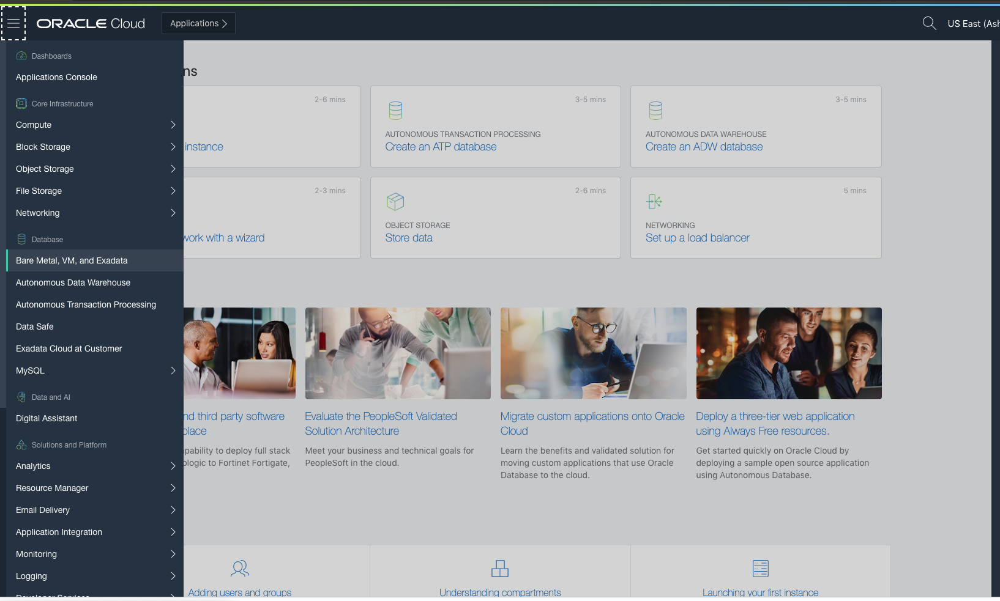
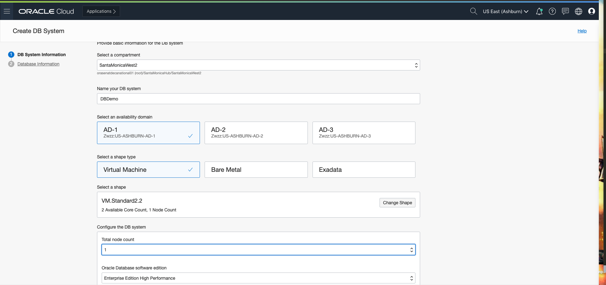
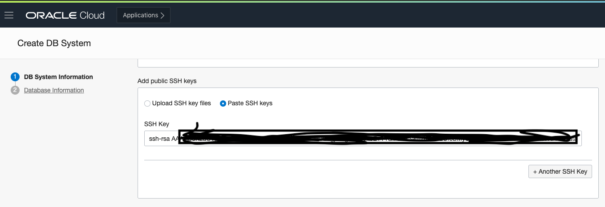
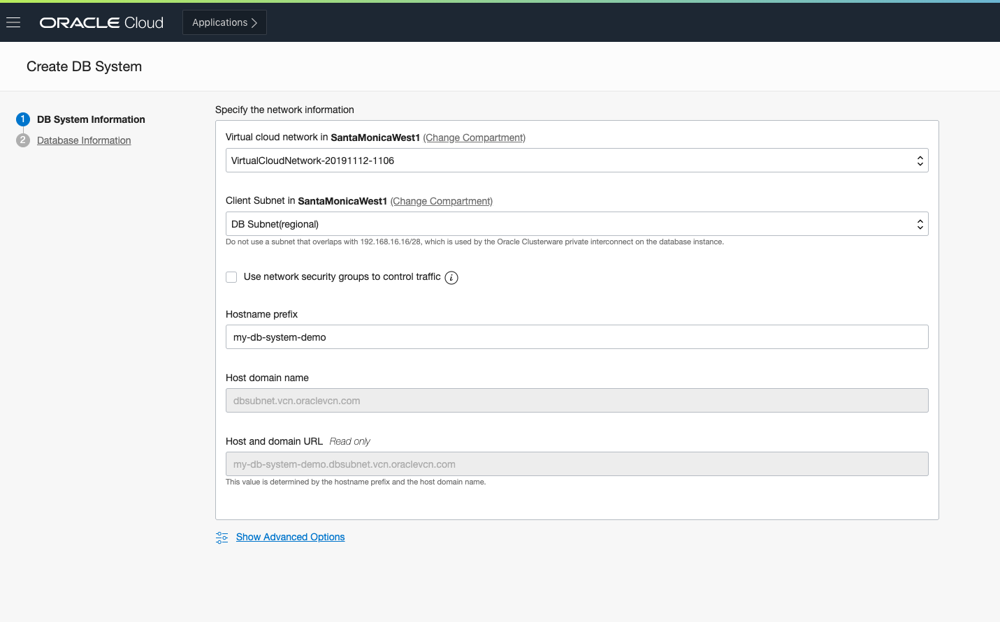
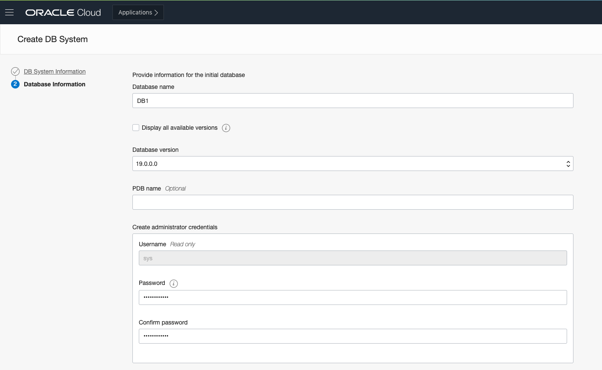
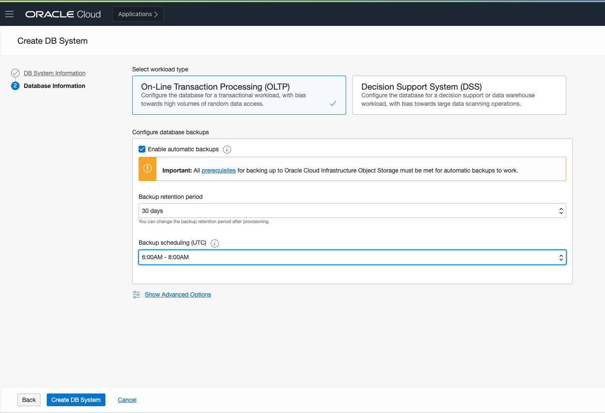
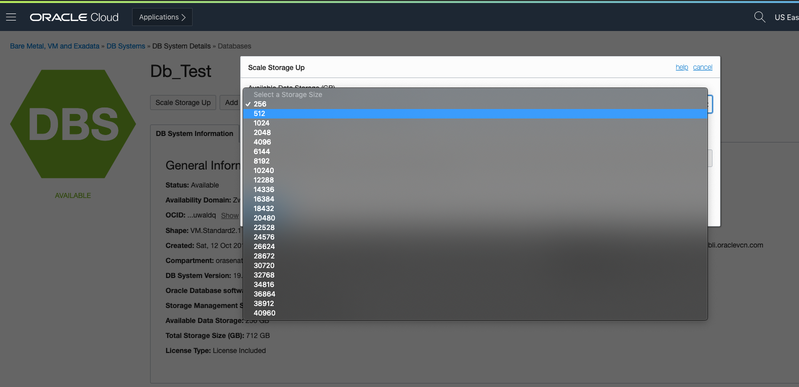

## Lab 7. Database

**Objectives**
- Provisioning and usage of database cloud service

**Overview** 

Oracle DBaaS offers several options for database types, shapes, and resources. Below we will show you how to create a Virtual Machine Database System with 2 cores using the networking resources created in the previous labs. 

**Database Provisioning**

1. Open the navigation menu. Under *Database*, click *Bare Metal, VM, and Exadata*.

2. Click *Create DB System*.

3. On the *Create DB System* page, provide the basic information for the DB system matching the screenshots accordingly: 

- *Select a compartment*: By default, the DB is created in your current compartment and you can use the network resources in that compartment. Ensure that you are using the compartment created in LAB1. 

- *Name your DB system*: A friendly, display name for the DB system. The name doesn't need to be unique. An Oracle Cloud Identifier (OCID) will uniquely identify the DB system. 

- *Select an availability domain*: The availability domain (AD) in which the DB system resides. 

- *Select a shape type*: The shape type you select sets the default shape and filters the shape options in the next field. Choose VM. 

- *Select a shape*: The shape determines the type of DB system created and the resources allocated to the system. To specifiy a shape other than the default, click *Change Shape*, and select *VM.Standard2.2*, which provides a 1- or 2-node DB system with 2 cores. 

**Configuring the DB System**

1. Specify the following: 

- *Total node count*: The number of nodes in the DB system. Select 2 nodes. 

- *Oracle Database software edition*: The database edition supported by the DB system. Leave as default. 

- *Choose Storage Management Software*: The storage management software for the DB system. Leave as default. 

- *Configure storage*: Choose 256 GB for the amount of Available Block Storage to allocate to the VM DB system. Available storage can be scaled up or down as needed after provisioning your DB system. 

**Add public SSH keys**

1. Add the public key portion of each key pair you want to use for SSH access to the DB system. You can browse or drag and drop .pub files, or paste in individual public keys. 

**Choose a license type**

1. The type of license you want to use for the DB system. Choose accordingly based on your license preferences. 

- *License included* means the cost of this Oracle Cloud Infrastructure Database service resource will include both the Oracle Database software licenses and the service. 

- *Bring Your Own License (BYOL)* means you will use your organization's Oracle Database software licenses for this Oracle Cloud Infrastructure Database service resource. 

**Configuring the network resources**

1. Specify the following network information: 

- *Virtual Cloud Network*: The VCN in which to launch the DB system. Select the VCN created in the previous labs.

- *Client Subnet*: The subnet to which the DB system should attach. Select from one of the subnets created in the previous lab. 

- *Hostname prefix*: Your choice of host name for the DB system. The host name must begin with an alphabetic character, and can only contain alphanumeric characters and hyphens (-). The maximum number of characters allowed for bare metal and virtual machine DB systems is 16. 

**Configuring the initial database**

1. Specify the following information for the initial database. 

- *Database name*: Give your initial database a simple name. 

- *Database version*: Choose the latest database version, 19.0.0.0.

- *Administrator credentials*: Supply a password for the SYS admin.

- *Workload type*: Choose the workload type that best suits your application:

	- *Online Transactional Processing (OLTP)* configures the database for a transactional workload, with a bias towards high volumes of random data access.

	- *Decision Support System (DSS)* configures the databse for a decision support or data warehouse workload, with a bias towards large scanning operations. 

- *Enable automatic backups*: Check the box to enable automatic incremental backups for this database and choose one of the preset retention periods for backups as well as the scheduling period. 

**Create the DB System**

1. Click *Create DB System*. The DB system will appear in the list with a yellow status of Provisioning. The DB system's icon will change from yellow to green once Available (or red to indicate errors).

**Scaling the DB System**

1. Once provisioned, choose the *Scale Storage Up* option to increase your available data storage. Choose 512 GB to scale up your storage from your initial specifications. 

