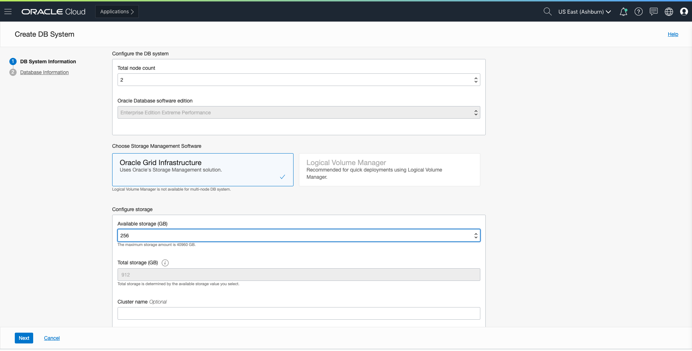

## Lab 7. Database

**Objectives**
- Provisioning and usage of database cloud service

**Overview** 

Oracle DBaaS offers several options for database types, shapes, and resources. Below we will show you how to create a VM with 2 cores using the networking resources created in the previous labs. 

**Database Provisioning**

1. Open the navigation menu. Under *Database*, click *Bare Metal, VM, and Exadata*.

2. Click *Create DB System*.

3. On the *Create DB System* page, provide the basic information for the DB system matching the screenshots accordingly: 

- *Select a compartment*: By default, the DB is created in your current compartment and you can use the network resources in that compartment. Ensure that you are using the compartment created in LAB1. 

- *Name your DB system*: A friendly, display name for the DB system. The name doesn't need to be unique. An Oracle Cloud Identifier (OCID) will uniquely identify the DB system. 

- *Select an availability domain*: The availability domain (AD) in which the DB system resides. 

- *Select a shape type*: The shape type you select sets the default shape and filters the shape options in the next field. Choose VM. 

- *Select a shape*: The shape determines the type of DB system created and the resources allocated to the system. To specifiy a shape other than the default, click *Change Shape*, and select *VM.Standard2.2*, which provides a 1- or 2-node DB system with 2 cores. 

**Configuring the DB System**

1. Specify the following: 

- *Total node count*: The number of nodes in the DB system. Select 2 nodes. 

- *Oracle Database software edition*: The database edition supported by the DB system. Leave as default. 

- *Choose Storage Management Software*: The storage management software for the DB system. Leave as default. 

- *Configure storage*: Choose 256 GB for the amount of Available Block Storage to allocate to the VM DB system. Available storage can be scaled up or down as needed after provisioning your DB system. 

**Add public SSH keys**

1. Add the public key portion of each key pair you want to use for SSH access to the DB system. You can browse or drag and drop .pub files, or paste in individual public keys. 

 